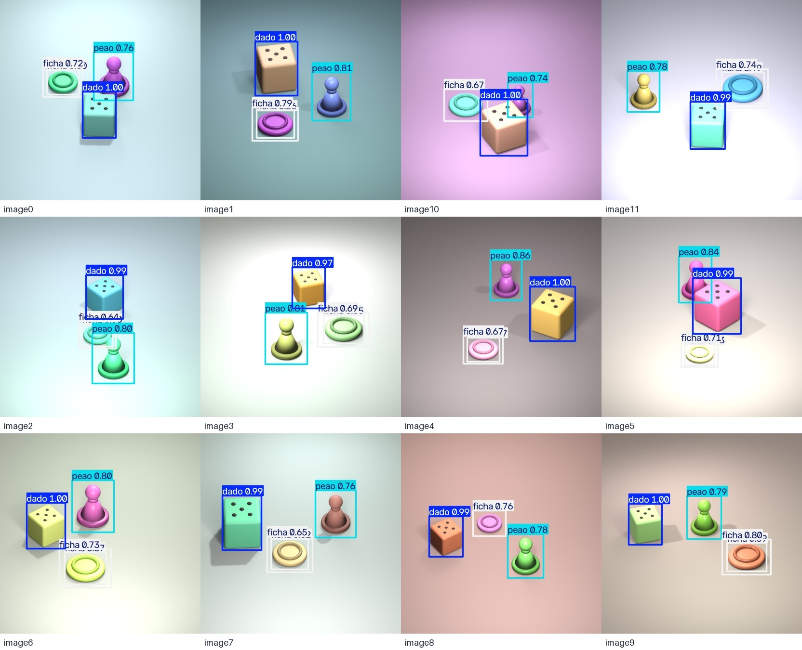
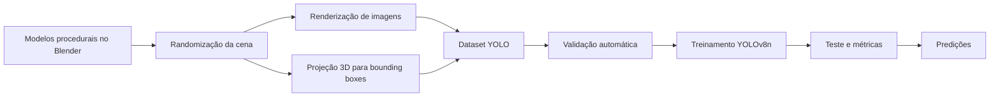
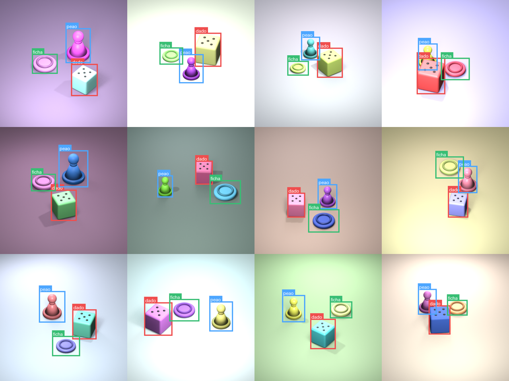
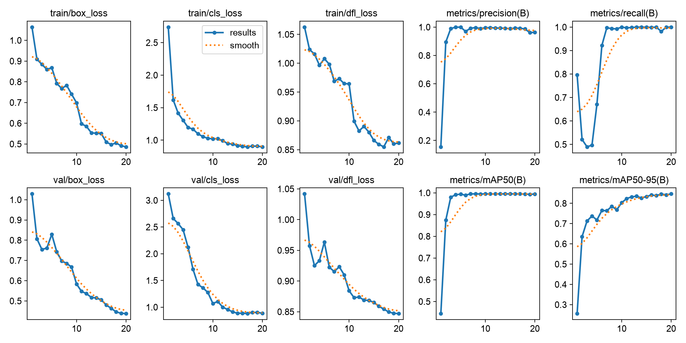

# BoardVision — detecção de peças de jogos com dados sintéticos

Projeto final do curso **FastCamp — Dados Sintéticos**, desenvolvido por **Fernanda Diniz**.

O BoardVision implementa um pipeline completo de visão computacional: cria uma cena procedural no Blender, gera imagens variadas, produz automaticamente anotações de detecção no formato YOLO, treina um YOLOv8n e avalia o modelo em um conjunto de teste separado.



## Problema e escopo

O objetivo é localizar e classificar três peças comuns de jogos de mesa:

| ID | Classe | Representação 3D |
|---:|---|---|
| 0 | `dado` | cubo chanfrado com marcações na face superior |
| 1 | `peao` | base, corpo cônico e cabeça esférica |
| 2 | `ficha` | disco cilíndrico com aro superior |

A tarefa escolhida foi **detecção de objetos por bounding boxes**. Em cada cena aparecem os três objetos, com variações de posição, rotação, escala, cor, rugosidade, fundo, câmera e iluminação. O escopo foi mantido propositalmente simples para permitir a execução completa e reproduzível do pipeline.

## Pipeline



## Dataset gerado

O dataset possui **240 imagens**, resolução de **416 × 416 pixels**, e **720 instâncias** anotadas. A distribuição é equilibrada: 240 exemplos de cada classe.

| Divisão | Imagens | Instâncias | Proporção |
|---|---:|---:|---:|
| Treino | 168 | 504 | 70% |
| Validação | 36 | 108 | 15% |
| Teste | 36 | 108 | 15% |
| **Total** | **240** | **720** | **100%** |

As anotações seguem o padrão `classe x_centro y_centro largura altura`, com coordenadas normalizadas entre 0 e 1. A validação automática verificou todos os pares imagem/rótulo e não encontrou arquivos ausentes, classes inválidas ou coordenadas fora do intervalo.



## Resultados

O modelo foi treinado por 20 épocas com transfer learning a partir do `yolov8n.pt`. No conjunto de teste, que não participou do treinamento, foram obtidos:

| Métrica | Resultado |
|---|---:|
| Precisão | **97,7%** |
| Recall | **100,0%** |
| mAP@50 | **99,5%** |
| mAP@50–95 | **80,9%** |
| Tempo de inferência no teste | **aprox. 5,1 ms/imagem** |

Por classe, o mAP@50 foi 99,5% para dado, peão e ficha. O dado teve a localização mais precisa no critério rigoroso mAP@50–95; peão e ficha foram mais sensíveis ao formato arredondado e às sombras, mas mantiveram classificação correta no limiar de IoU 0,50.



## Estrutura do projeto

```text
ProjetoFinal/
├── blender/
│   ├── boardvision_scene.blend       # cena final configurada
│   └── generate_dataset.py           # modelagem, randomização e anotação
├── dataset/
│   ├── images/{train,val,test}/
│   ├── labels/{train,val,test}/
│   ├── data.yaml
│   ├── metadata.jsonl
│   └── summary.json
├── models/
│   └── best.pt                       # melhor peso treinado
├── scripts/
│   └── validate_dataset.py
├── training/
│   ├── train_yolo.py
│   ├── evaluate_yolo.py
│   └── predict.py
├── results/                          # métricas, gráficos e predições
├── report/                           # relatório técnico em PDF
├── pitch/                            # vídeo e roteiro do pitch
└── requirements.txt
```

## Tecnologias

- Blender 5.2 LTS e API Python `bpy`;
- Python 3.11;
- Ultralytics YOLOv8 e PyTorch;
- Pillow, PyYAML, NumPy e OpenCV;
- Apple Metal Performance Shaders (MPS) no treinamento local.

## Como reproduzir

### 1. Clonar e preparar o ambiente

```bash
git clone https://github.com/Fefdiniz11/FastCamp-Dados-Sinteticos.git
cd FastCamp-Dados-Sinteticos/ProjetoFinal
python3 -m venv .venv
source .venv/bin/activate
python -m pip install --upgrade pip
python -m pip install -r requirements.txt
```

### 2. Gerar novamente o dataset no Blender

No macOS com Blender instalado em `/Applications`:

```bash
/Applications/Blender.app/Contents/MacOS/Blender \
  --background \
  --python blender/generate_dataset.py \
  -- --train 168 --val 36 --test 36 --resolution 416 --seed 42
```

O script cria os objetos, randomiza a cena, renderiza as imagens, projeta os limites 3D para a imagem e salva as bounding boxes no formato YOLO. O argumento `--preview` gera somente nove imagens para um teste rápido.

### 3. Validar imagens e rótulos

```bash
python scripts/validate_dataset.py --samples 12
```

O resultado textual é salvo em `results/dataset_validation.json`, junto com uma grade visual das anotações.

### 4. Treinar o detector

```bash
python training/train_yolo.py --epochs 20 --imgsz 416 --batch 16
```

O script seleciona automaticamente CUDA, MPS ou CPU. O melhor modelo é copiado para `models/best.pt`.

### 5. Avaliar no conjunto de teste

```bash
python training/evaluate_yolo.py --imgsz 416 --batch 16 --samples 12
```

As métricas são salvas em `results/test_metrics.json`; a matriz de confusão fica em `results/boardvision_test/`.

### 6. Fazer inferência em uma imagem nova

```bash
python training/predict.py caminho/para/imagem.png --conf 0.25
```

O arquivo anotado será salvo em `results/inference/`.

## Limitações e próximos passos

Os resultados medem o desempenho em imagens sintéticas produzidas pela mesma família de cenas. Apesar da diversidade visual aplicada, ainda existe **domain gap** em relação a fotografias reais, que podem incluir texturas complexas, desgaste, reflexos, oclusões severas, lentes diferentes e fundos não vistos.

Como evolução, recomenda-se gerar mais cenas, incluir oclusões controladas e texturas fotográficas, variar a geometria de cada classe e testar o modelo em um pequeno conjunto real. Esse conjunto permitiria medir o domain gap e orientar novos ciclos de randomização.

## Referências técnicas

- [Blender Python API](https://docs.blender.org/api/current/)
- [Ultralytics: formato de datasets de detecção](https://docs.ultralytics.com/datasets/detect/)
- [Ultralytics: treinamento de modelos](https://docs.ultralytics.com/modes/train/)
